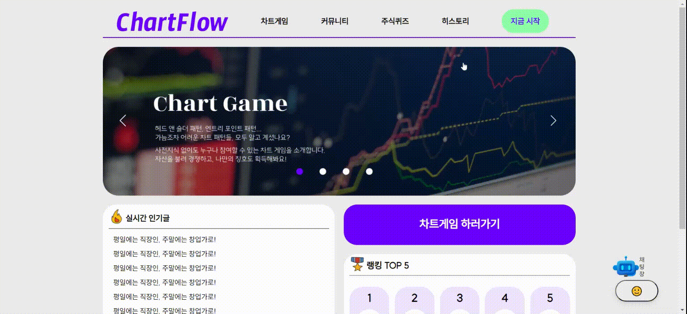

# ChartFlow

## 💌프로젝트 개요

* 2023.08.28 ~ 2023.10.06
* 주식 입문자를 위한 국내 2500여개 상장 기업 10개년 주식 데이터 기반 **모의투자** 게임 서비스
* 게이미피케이션의 요소로 **랭킹**, **칭호** 등의 기능을 제공하며 퀴즈와 커뮤니티 기능이 존재

  

## ❤️팀원 소개

- Frontend Team

| 이름   | 직책 | 담당 업무 |
| ------ | ---- | --------- |
| 이연주 |  F.E 총괄 | 페이지 및 컴포넌트 구현, axios 호출 |
| 류나연 |  F.E  | 페이지 구현 |

- Backend Team

| 이름   | 직책 | 담당 업무 |
| ------ | ---- | --------- |
| 김태현 | 팀장, 발표, B.E | 챗봇, 칭호, 랭킹 API 구현, axios 연동 |
| 김현식 | 서기, B.E | 퀴즈, 칭호 API 구현, axios 연동 |
| 최규헌 | 일정관리, B.E | 게임, 댓글, 회원기능 API 구현, axios 연동 |
| 최우석 | B.E | 게시판 API 구현 |

  

## 🕹️기술 스택

### Front-End
* React
* JavaScript
* AmCharts

### Back-End
* Spring Boot
* JPA
* Java
* MySQL

### Infra
* AWS EC2
* Jenkins

  

## 🔎서비스 소개

### 메인 화면 & 회원가입

* 회원가입은 이메일 인증을 통해 본인 인증을 진행합니다.
* 닉네임 중복 체크를 통해 커뮤니티 기능에서의 악용을 방지합니다.
* JWT, BCrypt 암호화를 통해 보안을 강화했습니다.

### 로그인 & 임시 비밀번호 발급

* 로그인 기능과 비밀번호를 잊은 경우 등록된 이메일을 통해 임시 비밀번호를 발급받을 수 있습니다.

### 차트게임

* 랜덤한 기업의 랜덤한 시점의 1개년 치 데이터를 기반으로 차트게임을 수행합니다.
* 50턴까지 진행 가능하며 도중에 종료하고 이어서 할 수 있습니다.
* 게임 진행 시 '코인'을 1개 소모하며 게임 진행 시 시점을 되돌릴 수 없습니다.

### 커뮤니티

* 좋아요, 댓글, 대댓글이 가능합니다.
* 추가 기능으로 칭호와 보유 자산을 표기하는 방식을 추가할 예정입니다.
* 또한, 좋아요를 10개 받을 때마다 글 작성자에게 '코인'이 1개씩 지급됩니다.

### 퀴즈

* 하루에 3개씩 경제 관련 퀴즈가 제공됩니다.
* 정답을 맞출 시에 '코인'을 1개 지급합니다.

  

## 아키텍처

  

## 회고 & 개선점

* 구현된 API를 모두 연동시키지 못해 아쉬운 프로젝트입니다.
* 차트 게임에서 복잡한 서비스 로직을 구현하는 데 있어 설계와 검증이 중요하다는 것을 깨달았습니다.
* 차후 랭킹, 칭호 API를 모두 연동 시키고 프론트 단에서의 알림까지 모두 구현하는 것이 남은 과제입니다.